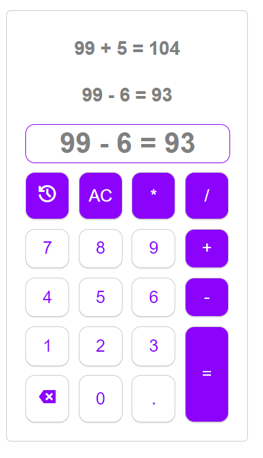

# React Calculator App

This project is a simple calculator built with React and powered by Vite. It's designed to perform basic arithmetic operations such as addition and subtraction.

## Features

- Perform basic arithmetic operations (addition, subtraction).
- Clean and user-friendly interface.
- History feature to view previous calculations.

## Screenshot

